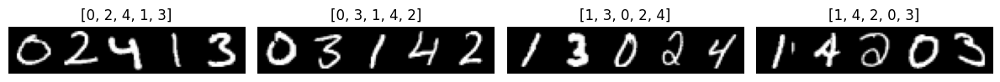
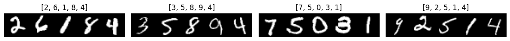
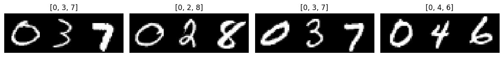

# CSMNIST: Constrained Sequences of MNIST Digits
CSMNIST is a flexible dataset generator that creates sequences of MNIST digits
based on user-defined constraints. It is meant as an easy baseline for
constrained sequence modeling research, where the goal is to guarantee that
predicted sequences satisfy certain constraints.



## Installation
1. Clone this repository:
   ```sh
   git clone https://github.com/klamike/CSMNIST.git
   ```

2. Install the package:
   ```sh
   pip install -e CSMNIST
   ```

## Usage

This section contains a few usage examples. The first example makes use of a custom solver
for generating sequences of fixed length where all digits are different:

```python
from csmnist import CSMNISTDataset, AllDifferentGenerator

generator = AllDifferentGenerator(length=5, seed=42)

# Create the CSMNIST dataset
# with on-the-fly generation:
dataset = CSMNISTDataset(mnist_root='./data', train=True, generator=generator)

# or, pre-generate the dataset:
sequences = generator.generate_dataset(100)
dataset = CSMNISTDataset(mnist_root='./data', train=True, sequences=sequences)

# Use the dataset in your PyTorch DataLoader
from torch.utils.data import DataLoader
dataloader = DataLoader(dataset, batch_size=4)

# Iterate through the data
for images, labels in dataloader:
    # Your training loop here
    pass
```


Using brute force (random sampling), sample ordered sequences with length 3 and sum 10:

```python
from csmnist import CSMNISTDataset, BruteForceGenerator, LengthConstraint
from csmnist.constraints import SumConstraint, OrderedConstraint, LengthConstraint
from csmnist.viz import visualize_sample
from torch.utils.data import DataLoader

generator = BruteForceGenerator(
    constraints=[
        LengthConstraint(3),
        SumConstraint(10),
        OrderedConstraint(ascending=True)
    ],
    min_length=3,
    max_length=3,
    max_tries_per_sample=float("inf"),
    seed=42
)

dataset = CSMNISTDataset(mnist_root='./data', train=True, generator=generator)
dataloader = DataLoader(dataset, batch_size=4)
batch = next(iter(dataloader))
visualize_sample(batch)
```


Using ORTools, sample 5x5 N-Queens solutions:

```python
from csmnist import CSMNISTDataset, ORToolsGenerator

from ortools.constraint_solver.pywrapcp import Solver

# Define the ORTools model like usual
board_size = 5
B = range(board_size)

solver = Solver("n-queens")

queens = [solver.IntVar(0, board_size - 1, f"x{i}") for i in B]

solver.Add(solver.AllDifferent(queens))
solver.Add(solver.AllDifferent([queens[i] + i for i in B]))
solver.Add(solver.AllDifferent([queens[i] - i for i in B]))

db = solver.Phase(queens, solver.CHOOSE_FIRST_UNBOUND, solver.ASSIGN_MIN_VALUE)
solver.NewSearch(db)

# Create the CSMNIST generator and dataset
generator = ORToolsGenerator(solver, queens, seed=42)

dataset = CSMNISTDataset(mnist_root='./data', train=True, generator=generator)
dataloader = DataLoader(dataset, batch_size=4)
batch = next(iter(dataloader))
visualize_sample(batch)
```
